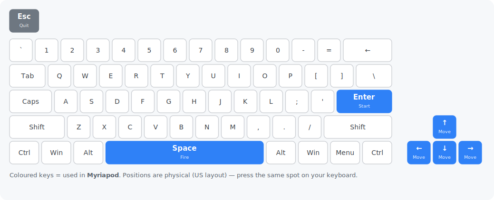

# Myriapod — Go port

[](https://github.com/chrplr/myriapod-go/releases/latest)

**▶ Play it in your browser: <https://chrplr.github.io/myriapod-go/>**

A Go re-implementation of the Pygame Zero game **Myriapod** from *Code the Classics
Volume 1* (Raspberry Pi Press), built on
[go-sdl3](https://github.com/Zyko0/go-sdl3) and the
[pgzgo](https://github.com/chrplr/pgzgo) harness.

All images, sounds and music are embedded, so `go build` produces a single
self-contained binary that needs no asset files at run time.

## Controls

Keyboard only.

| Action | Key |
|--------|-----|
| Move   | Arrow keys |
| Fire   | Space (the gun also fires while you move) |
| Start  | Space / Enter |
| Quit   | Esc |

The picture below shows which key each action uses. They're all arrow keys, `Space` and `Enter`, which sit in the same place on every keyboard layout.



## How to play

**The goal.** It's a Centipede-style shooter. A long, many-segmented **myriapod** winds its way down the screen toward you through a field of rocks. Shoot it to pieces before it reaches you, then survive the next wave — and the next.

**Splitting the myriapod.** Every segment you hit is destroyed, breaking the creature into shorter chains that keep crawling. Clear every last segment to end the wave; each new wave is faster and longer.

**The battlefield.** **Rocks** litter the arena — they block both your shots and the myriapod's path (the creature drops down a row whenever it hits one), and some rocks can be shot away to open lanes. Keep an eye out for **flying enemies** that swoop across and drop in extra rocks.

**Surviving.** You move around the bottom of the screen and your gun fires with **Space** (it keeps firing while you move, so you can shoot on the run). Getting touched by the myriapod or a flier costs one of your **3 lives** — lose them all and it's game over.

## Download

Prebuilt, self-contained binaries — no install, no dependencies, assets embedded.
Grab the latest for your platform:

- **Linux** (amd64) — [myriapod-linux-amd64.tar.gz](https://github.com/chrplr/myriapod-go/releases/latest/download/myriapod-linux-amd64.tar.gz)
- **macOS** (Apple Silicon) — [myriapod-macos-arm64.tar.gz](https://github.com/chrplr/myriapod-go/releases/latest/download/myriapod-macos-arm64.tar.gz)
- **Windows** (amd64) — [myriapod-windows-amd64.zip](https://github.com/chrplr/myriapod-go/releases/latest/download/myriapod-windows-amd64.zip)

All versions are on the [releases page](https://github.com/chrplr/myriapod-go/releases).

## Run

```sh
go run .
```

go-sdl3 bundles the SDL3, SDL3_image and SDL3_mixer libraries and extracts them at
startup, so no system SDL install is needed.

## Provenance & license

Ported to Go from the Python original in *Code the Classics Volume 1*. The game
design and original assets are © their respective authors / Raspberry Pi Press.

The original Python code and assets are in Raspberry Pi Press's [Code the Classics — Volume 1](https://github.com/raspberrypipress/Code-the-Classics-Vol1) repository.

The Go source code of this port is distributed under the MIT License.

See `Python_and_Go_implementation_comparison.md` for a walkthrough of how the port
maps onto the original.
